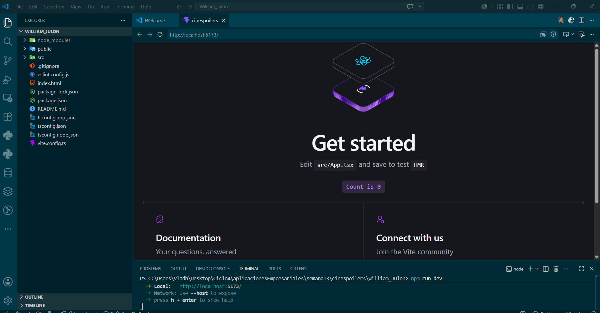
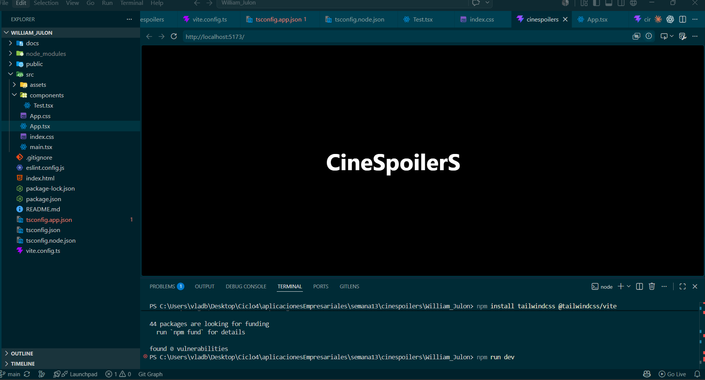
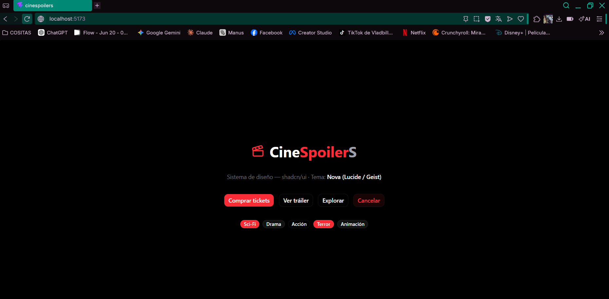
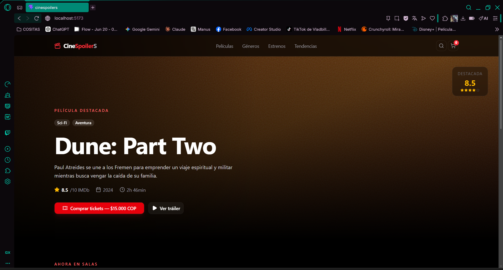

# Laboratorio 13
---
## Integrantes:

```
 - William Julon
 - Alexander sanabria
 - Gabriel Llanos

```

# William Julon

## Proyecto iniciado 



## Tailwind Implementado



## Shadcn instalado y primeros componentes implementados



## Layaout completo usando Shadcn

